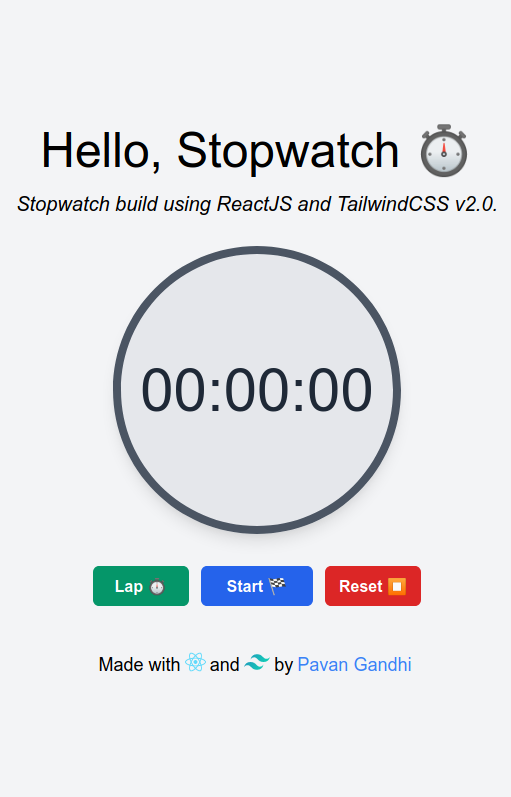
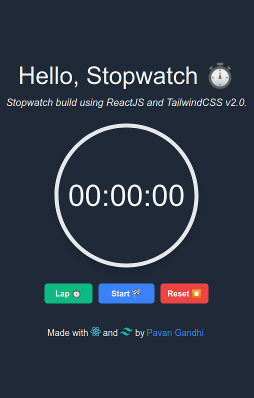

<div align="center">

#  **React Tailwind Stopwatch**

## Stopwatch build using ReactJS and TailwindCSS v2.0.

</div>

## Stopwatch WebApp Screenshots

<div>




</div>

<br/>

## Tech Stack

<code></code>
<code></code>
<code></code>

## Build Setup

```bash
# install dependencies
yarn install

# runs the app in the development mode.
yarn start

# builds the app for production to the build folder.
yarn build
```

## Contributing

Feel free to dive in! [Open an issue](https://github.com/iampavangandhi/ReactTailwindStopwatch/issues/new) or submit PRs.

## License

[MIT](LICENSE) © Pavan Gandhi
